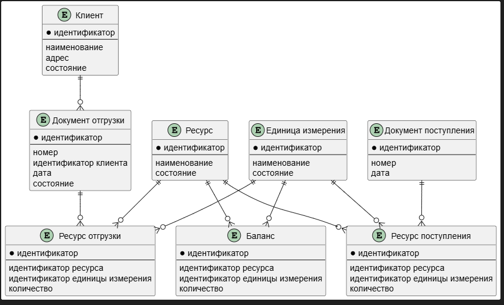

# wms-test
Тестовое задание. Приложение, автоматизирующее (упрощенно) работу склада

## Запуск

Создайте в корневой директории файл *.env*, и заполните его по аналогии с содержимым файла *.env.example*

Для запуска используйте команду

``` bash
docker-compose up
```

